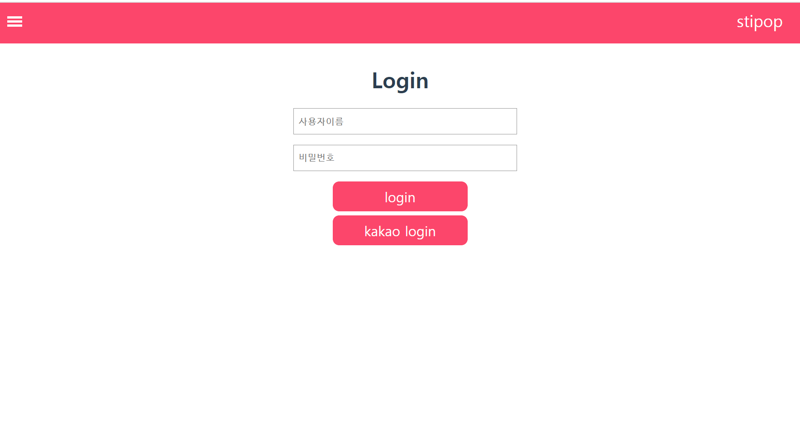

# stipop

## 1. Project 설치 및 실행
```
npm install
npm run serve
```


## 2. 참고사항

- backend가 있다 생각하고 프론트엔드만 작성하였습니다.

- 시간상 리드미 이미지가 안보일 수 있어서, pdf를 따로 추가합니다

- 본 과제에 key는 모두 숨길예정이며, 이메일로 따로 발송할 예정입니다.

- 카카오 공유하기는 http://localhost:8080 에서만 작동합니다.

- 위치는 아래 세군대입니다

  - kakao_key: STI>public>index.html  > "input your kakao key" 

  - stipop_key: sti>src>components>CardBox.vue > "input your stipop key"> 
  - stipop_key: sti>src>components>carousel.vue> "input your stipop key"


## 3. 구현사항

1. 3d corusel


2. sidebar


3. login page



4. search


5. detail


6. 카카오 공유하기

